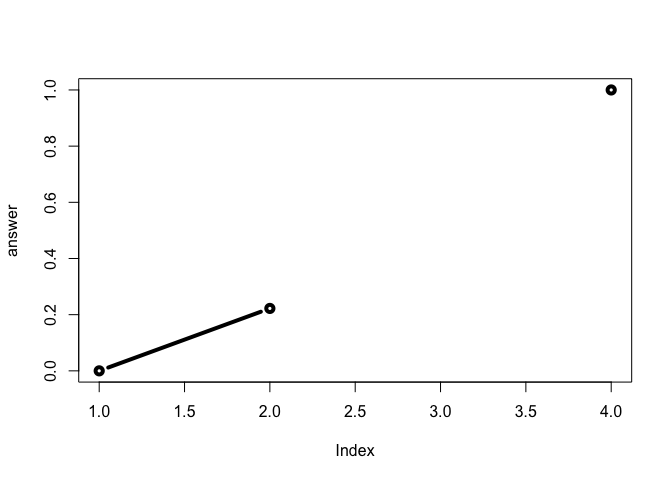

Class 6: R Functions
================
Melissa Ito
4/18/2019

About
=====

This is my **class 6** R markdown document with my *code* and notes for the day.

``` r
plot (1:10, type = "l", col = "blue")
```


Reading in files practice
-------------------------

There are 3 files to read.

``` r
read.table ("test1.txt", header = TRUE, sep = ",")
```

    ##   Col1 Col2 Col3
    ## 1    1    2    3
    ## 2    4    5    6
    ## 3    7    8    9
    ## 4    a    b    c

using defaults from read.csv saves time

``` r
read.csv ("test1.txt")
```

    ##   Col1 Col2 Col3
    ## 1    1    2    3
    ## 2    4    5    6
    ## 3    7    8    9
    ## 4    a    b    c

specify $ symbol separating variables

``` r
read.table ("test2.txt", header = TRUE, sep = "$")
```

    ##   Col1 Col2 Col3
    ## 1    1    2    3
    ## 2    4    5    6
    ## 3    7    8    9
    ## 4    a    b    c

test3.txt is separated by white space not tabs or comma or semicolon therefore use read.table

``` r
read.table ("test3.txt", header = FALSE)
```

    ##   V1 V2 V3
    ## 1  1  6  a
    ## 2  2  7  b
    ## 3  3  8  c
    ## 4  4  9  d
    ## 5  5 10  e

can also use URL instead of downloading into class6 file

``` r
read.csv ("https://bioboot.github.io/bimm143_S19/class-material/test2.txt", header = TRUE, sep = "$")
```

    ##   Col1 Col2 Col3
    ## 1    1    2    3
    ## 2    4    5    6
    ## 3    7    8    9
    ## 4    a    b    c

Functions
---------

Our first silly function example:

``` r
add <-  function(x, y = 1) {
  #the body!!
  x + y
}
```

``` r
add(10)
```

    ## [1] 11

``` r
add (10, 10)
```

    ## [1] 20

default y = 1 and adds 1 to each x value specify y = 4 will add 4 to each x value

``` r
add ( c (1, 2, 2))
```

    ## [1] 2 3 3

``` r
add( c (1, 2, 3), 4)
```

    ## [1] 5 6 7

``` r
c (1, 2, 3) + 4
```

    ## [1] 5 6 7

these functions will result in errors

``` r
#add (1, 2, 2)
#add (x =1, y = "b")
```

Another example
---------------

``` r
rescale <- function(x) {
   rng <-range(x)
   (x - rng[1]) / (rng[2] - rng[1])
}
```

``` r
rescale (1:10)
```

    ##  [1] 0.0000000 0.1111111 0.2222222 0.3333333 0.4444444 0.5555556 0.6666667
    ##  [8] 0.7777778 0.8888889 1.0000000

``` r
# How would you get your function to work here...
rescale( c(1,2,NA,3,10) )
```

    ## [1] NA NA NA NA NA

``` r
x <-  c(1,2,NA,3,10) 
rng <-range(x, na.rm = TRUE)
rng
```

    ## [1]  1 10

``` r
    (x - rng[1]) / (rng[2] - rng[1])
```

    ## [1] 0.0000000 0.1111111        NA 0.2222222 1.0000000

``` r
range (c(1,2,3,10))
```

    ## [1]  1 10

``` r
rescale2 <- function(x, na.rm = TRUE) {
   rng <-range(x, na.rm = na.rm)
   (x - rng[1]) / (rng[2] - rng[1])
}
```

``` r
rescale2( c(1, 3, NA, 10))
```

    ## [1] 0.0000000 0.2222222        NA 1.0000000

``` r
# What should your function do here?
 #rescale( c(1,10,"string") ) 
```

``` r
# x <- c (1, 10, "string")

if(!is.numeric (x)) {
  stop ("You need to give only numbers please")
}

# range (x, na.rm = TRUE)
# (x - rng[1]) / (rng[2] - rng[1])
```

``` r
#rescale2 (c (1, 10, "string"))
```

``` r
 rescale3 <- function(x, na.rm=TRUE, plot=FALSE) {
   
    rng <-range(x, na.rm=na.rm)
    print("Hello")
    
   answer <- (x - rng[1]) / (rng[2] - rng[1])
   
   
   print("is it me you are looking for?") 

   if(plot) {
      plot(answer, typ="b", lwd=4)
     print("Please don't sing again...")
   }
   print("I can see it in ...")
   return(answer)
 }
```

``` r
rescale3 ( c(1, 3, NA, 10))
```

    ## [1] "Hello"
    ## [1] "is it me you are looking for?"
    ## [1] "I can see it in ..."

    ## [1] 0.0000000 0.2222222        NA 1.0000000

``` r
rescale3 ( c(1, 3, NA, 10), plot = TRUE)
```

    ## [1] "Hello"
    ## [1] "is it me you are looking for?"



    ## [1] "Please don't sing again..."
    ## [1] "I can see it in ..."

    ## [1] 0.0000000 0.2222222        NA 1.0000000

``` r
rescale3a <- function(x, na.rm=TRUE, plot=FALSE) {
   
    rng <-range(x, na.rm=na.rm)
    print("Hello")
    
   answer <- (x - rng[1]) / (rng[2] - rng[1])
   
    return (answer)
   
   print("is it me you are looking for?") 

   if(plot) {
      plot(answer, typ="b", lwd=4)
     print("Please don't sing again...")
   }
   print("I can see it in ...")
   return(answer)
 }
```

``` r
# will stop processing once it hits the first return(answer) function
rescale3a (c(1, 2, NA, 10))
```

    ## [1] "Hello"

    ## [1] 0.0000000 0.1111111        NA 1.0000000
