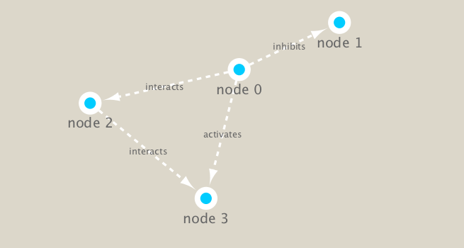

```{r setup, include=FALSE}
knitr::opts_chunk$set(echo = TRUE)
```

## Set up Cytoscape and R connection

We will use the **RCy3** and **igraph** packages in this class.
The first is from bioconductor the second from CRAN.

```{r install, eval=FALSE}
# from bioconductor
BiocManager::install("RCy3")

# from CRAN
install.packages("igraph")
```


```{r}
library(RCy3)
library(igraph)
```

```{r}
# Test the connection to Cytoscape.
cytoscapePing()
```

```{r}
# Check the version
cytoscapeVersionInfo()
```

We can test things further by making a small network (here in igraph format as used by the R igraph package) and sending it to Cytoscape:

```{r}
g <- makeSimpleIgraph()
createNetworkFromIgraph(g,"myGraph")
```

Change the network display style in cytoscape.

```{r}
setVisualStyle("Marquee")
```

```{r}
fig <- exportImage(filename="demo_marquee", type="png", height=350)


```

```{r}
g
```


```{r}
plot(g)
```


## Read our metagenomics data

```{r}
## scripts for processing located in "inst/data-raw/"
prok_vir_cor <- read.delim("virus_prok_cor_abundant.tsv", stringsAsFactors = FALSE)

## Have a peek at the first 6 rows
head(prok_vir_cor)
```

Use the igraph function **graph.data.frame()** to make a network graph.

```{r}
g <- graph.data.frame(prok_vir_cor, directed = FALSE)
```

```{r}
plot(g)
```

Turn the node(vertex) labels off.
```{r}
# turn off blue text labels
plot(g, vertex.label=NA)
```

The nodes/vertex are too big. Lets make them smaller...
```{r}
plot(g, vertex.size=3, vertex.label=NA)
```
 
Send this network to Cytoscape
```{r}
createNetworkFromIgraph(g,"mygraph")
```
# Network querys

Note that we can query (and set) vertex and edge attributes with the V() and E() functions respectively:
```{r}
V(g)
```
```{r}
E(g)
```

# Network community detection

Community structure detection algorithms try to find dense subgraphs within larger network graphs. Here we use the classic Girvan & Newman betweenness clustering method. 

```{r}
cb <- cluster_edge_betweenness(g)
```

```{r}
cb
```

```{r}
plot(cb, y=g, vertex.label=NA,  vertex.size=3)
```

You can extract a cluster/community membership vector for further inspection with the **membership()** function:

```{r}
head( membership(cb) )
```

# Node degree

The degree of a node or vertex is its most basic structural property, the number of its adjacent edges. Here we calculate and plot the node degree distribution.
  Note again the scale-free nature of this network with a small number of nodes with high degree   values and many nodes with low degree values.

```{r}
# Calculate and plot node degree of our network
d <- degree(g)
hist(d, breaks=30, col="lightblue", main ="Node Degree Distribution")
```

For the degree_distribution() function a numeric vector of the same length as the maximum degree plus one is returned. The first element is the relative frequency zero degree vertices, the second vertices with degree one, etc.

```{r}
plot( degree_distribution(g), type="h" )
```

## Centrality analysis

Centrality analysis often aims to answer the following question: Which nodes are the most important and why?

```{r}
pr <- page_rank(g)
head(pr$vector)
```

Lets plot our network with nodes size scaled via this page rank centrality scores.
```{r}
# Make a size vector btwn 2 and 20 for node plotting size

v.size <- BBmisc::normalize(pr$vector, range=c(2,20), method="range")
plot(g, vertex.size=v.size, vertex.label=NA)
```


## Read taxonomic classification for network annotation

```{r}
phage_id_affiliation <- read.delim("phage_ids_with_affiliation.tsv")
head(phage_id_affiliation)
```

```{r}
bac_id_affi <- read.delim("prok_tax_from_silva.tsv", stringsAsFactors = FALSE)
head(bac_id_affi)
```

```{r}
## Extract out our vertex names
genenet.nodes <- as.data.frame(vertex.attributes(g), stringsAsFactors=FALSE)
head(genenet.nodes)
```


